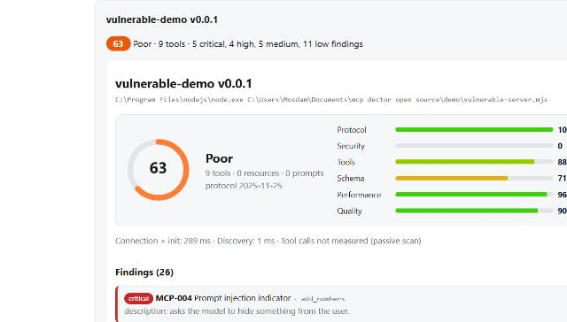
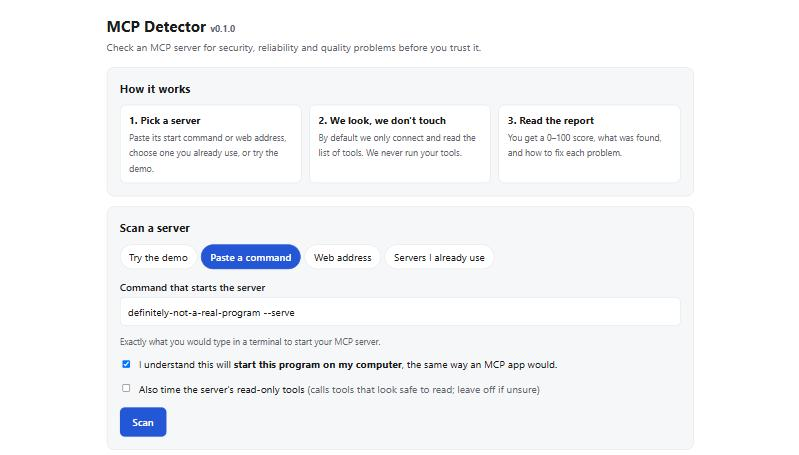

# MCP Detector for beginners

No coding needed. This guide takes about 10 minutes the first time and about 10 seconds after that.

## What is this?

AI assistants such as Claude can be given extra abilities by plugging in small add-ons. The add-ons are called **MCP servers**. They can read files, search the web, send messages, run programs, and so on.

Some add-ons are well built. Some are sloppy, and a few are deliberately dangerous: they can hide instructions that trick your AI into leaking your files or doing things you never asked for.

**MCP Detector is a safety check for those add-ons.** You point it at one, and it tells you:

- a **score from 0 to 100** (higher is better),
- **what it found**, in order of seriousness,
- **how to fix** each problem.

It runs on your own computer. By default it only *looks* at an add-on; it does not make the add-on do anything.

> **Important:** the score is a helpful warning light, not a guarantee. A high score does not prove an add-on is safe, and a low score does not always mean it is malicious. Use it to decide what to look at more closely.

## Who is this for?

- You use AI tools that have add-ons, and you want to check one before you trust it.
- You built an add-on and want to find problems before you share it.
- You are curious what a safety report looks like (there is a demo, see Step 4).

## What you need

- A Windows or Mac computer (Linux works too).
- An internet connection for the first-time setup.
- About 10 minutes.

## Step 1: Install Node.js (one time)

MCP Detector runs on a free program called **Node.js**. You install it once, like any other program.

1. Go to **https://nodejs.org**
2. Click the big **LTS** download button.
3. Open the downloaded file and click **Next** / **Continue** until it finishes. The default choices are fine.

Not sure whether you already have it? Skip this step. The launcher in Step 3 checks for you and tells you what to do.

## Step 2: Download MCP Detector

1. Open **https://github.com/adebayomoses/MCP-Doctor**
2. Click the green **Code** button, then **Download ZIP**.
3. Open your Downloads folder, right-click the ZIP file and choose **Extract All** (Mac: double-click it).
4. Move the new folder somewhere you will find it again, for example Documents.

## Step 3: Start it

Open the folder you just extracted and find the start file for your computer:

| Your computer | Double-click this file |
|---|---|
| **Windows** | `start-app.bat` |
| **Mac** | `start-app.command` |

A black or white text window opens and shows messages. **The first time, it downloads what it needs. This takes a minute or two and only happens once.** Your web browser then opens on its own with MCP Detector.

**Keep the text window open while you use the app.** It is the app's engine. Closing it stops the app.

### If your computer asks "are you sure?"

This is normal for programs that did not come from an app store.

- **Windows:** a blue box says *"Windows protected your PC"*. Click **More info**, then **Run anyway**.
- **Mac:** it says the file *"cannot be opened because it is from an unidentified developer"*. Right-click (or Control-click) the file, choose **Open**, then click **Open** again. If that does not work, see "Mac won't open the file" below.

You can check what the start file does by opening it in Notepad or TextEdit. It is about 40 lines: it checks that Node.js is installed, prepares MCP Detector, and starts the app. Nothing else.

## Step 4: Try the demo

When the page opens you see this:

The **Try the demo** tab is already selected.

1. Click **Scan the unsafe example**.
2. Wait a few seconds. A result appears below the buttons.

The demo scans a small built-in test add-on that was written to be dangerous, so you can see what problems look like. **It touches nothing on your computer.**

## Step 5: Read the report

- **The big number** is the overall score: 90 and up is excellent, 80-89 good, 70-79 fair, 50-69 poor, below 50 critical.
- **The bars** show six areas: *Protocol* (does it follow the rules), *Security*, *Tools*, *Schema* (are inputs checked), *Performance*, and *Quality*.
- **Findings** are the individual problems, most serious first. Click one to open it.
  - **critical** and **high** (red and orange): look at these first.
  - **medium** and **low**: worth fixing, rarely urgent.
  - **info**: a note.
- Each finding shows **the evidence** (the exact text that triggered it), **why it matters**, and **how to fix it**.

You can **download the report** (a web page you can send to someone) from the buttons under the report.

## Step 6: Check your own add-on

Click one of the other tabs.

### "Servers I already use" (easiest)

MCP Detector looks in Claude Desktop, Cursor, VS Code, Windsurf and Claude Code and lists the add-ons you have set up. Tick the ones to check, tick the confirmation box, and click **Scan ticked servers**. If the list is empty, none of those apps has add-ons set up on this computer.

### "Paste a command"

Some add-ons start with a command, such as `npx -y @modelcontextprotocol/server-everything`. This is usually in the add-on's instructions. Paste it in the box.

**Why the checkbox?** Checking an add-on this way actually *starts* it on your computer, exactly like your AI app would. That is safe for add-ons you already use or trust, but you should only do it for ones you are willing to run. The box makes sure that is a choice you make.

### "Web address"

For add-ons that live on the internet and have an address like `https://example.com/mcp`. If the add-on asks you to sign in, enter the header it told you to use (for example *Authorization* and *Bearer your-token*). Headers are used for that one check and are never saved.

## Is it safe? Common questions

**Does it send my information anywhere?**
No. It runs on your computer and only talks to the add-on you ask it to check. It does not collect or upload anything, and there is no tracking.

**Does it change my files?**
It creates one folder called `.mcp-detector` inside the MCP Detector folder, holding your past results. You can delete it any time.

**Will it make my add-ons do things?**
No, not unless you tick the optional box that says it will also *time the add-on's read-only tools*. Leave that off if you are not sure.

**Can a website or another person use it?**
No. It only listens on your own computer. The web page is protected by a private key that is in the link the app opens; other websites cannot use it.

**Who made the add-on I am checking? Can this tell me?**
No. It looks at what the add-on *does and says about itself*, not who made it.

## Stopping and restarting

- **Stop:** close the text window (or click it and press **Ctrl+C**).
- **Start again later:** double-click the same start file. It is quick after the first time.
- **Update:** download the ZIP again, extract it, and use the new folder.

## Something went wrong

**"Node.js is not installed" or "too old"**
The launcher explains this and opens the download page. Install the **LTS** version (version 22.12 or newer), then double-click the start file again.

**The page says "Open this page from your terminal"**
The page needs the private key from the link the app printed. Use the link shown in the text window (it contains `#token=...`), or close the app and double-click the start file again.

**Nothing opened in my browser**
Look in the text window for a line that starts with `http://127.0.0.1`. Copy the whole link into your browser.

**"Port is already in use"**
The app is probably already running. Close the old text window, then start it again.

**"The program ... was not found"**
When you scan a pasted command, the first word must be a program on your computer, such as `npx`, `node` or `python`. Check for typos. Commands that start with `npx` need Node.js, which you already installed.

**"The server did not finish starting"**
The first time you check an `npx` add-on it has to download it, which can be slow. Try again: it is usually quick the second time.

**"This server needs you to sign in"**
Add the sign-in header in the **Web address** tab.

**Mac won't open the file**
Open the **Terminal** app, type `bash ` (with a space after it), drag `start-app.command` into the Terminal window, and press **Enter**.

**It still does not work**
Please report it at https://github.com/adebayomoses/MCP-Doctor/issues. Copy the text from the text window into your message; it usually shows the cause.

## Words used in this guide

| Word | Meaning |
|---|---|
| **MCP** | Model Context Protocol, the standard way AI assistants plug into add-ons. |
| **MCP server** | One of those add-ons. (It is not necessarily a big computer: it is usually just a small program.) |
| **Tool** | One thing an add-on lets the AI do, such as "read a file". |
| **Finding** | One problem or warning in a report. |
| **Passive scan** | Looking at an add-on without making it do anything. This is what MCP Detector does by default. |
| **Terminal / text window** | The window where programs show messages. You never have to type in it for this guide. |

## Want to go further?

- [The web app in detail](web-app.md), including its security design.
- [The command line](../README.md), for developers and automated checks.
- [What each rule detects](rules.md).
